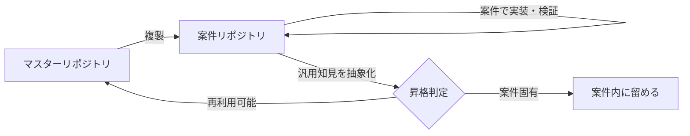

# マスターリポジトリへの知見還元（フィードバックループ）

このリポジトリは、案件ごとに複製して使う **マスターリポジトリ** です。
各案件で得られた汎用的に再利用できる知見を、案件リポジトリからこのマスターへ戻し、
案件を重ねるごとにマスターを育てる運用を前提とします。

> [!IMPORTANT]
> 案件固有の値・要件・成果物はマスターへ戻しません。戻すのは「他案件でも再利用できる形に抽象化したもの」だけです。

---

## 1. 二層構造

| 層                 | 役割                                                           | 例                                                               |
| ------------------ | -------------------------------------------------------------- | ---------------------------------------------------------------- |
| マスターリポジトリ | 再利用可能な標準資産を蓄積する場。案件横断で育て続ける         | スキル、設計パターン、実装テンプレート、検証手順、補助スクリプト |
| 案件リポジトリ     | マスターを複製して個別案件を進める場。顧客要件をここで実装する | 顧客固有 UI、業務フロー、環境設定、案件専用スクリプト            |

開発の流れは「マスターを複製 → 案件で実装 → 汎用知見を抽象化 → マスターへ還元」のループです。



---

## 2. マスターへ昇格する / しないの基準

### 昇格する（マスターへ戻す）

- 複数案件で再利用できるスキル本文・設計パターン・実装手順
- 共通 UI コンポーネント、共通フック、共通ユーティリティ
- 汎用的なデプロイ / 検証 / 調査スクリプト
- 同じ失敗を繰り返さないためのトラブルシュート・教訓
- 公式仕様の変更に追従した恒久的な対応方針

### 昇格しない（案件内に留める）

- 顧客名、テナント URL、環境 ID、接続情報、シークレット、承認フローなどの固有値
- 特定顧客の業務要件・画面・帳票・データモデルそのもの
- 案件限定の暫定ワークアラウンド（恒久対応に昇華できない限り戻さない）
- 検証用のデモデータや一時ファイル

---

## 3. 戻し先マッピング

| 還元する内容                         | 戻し先                                         |
| ------------------------------------ | ---------------------------------------------- |
| スキルの本体手順                     | `.github/skills/{skill}/SKILL.md`              |
| スキルの補足知識・教訓               | `.github/skills/{skill}/references/`           |
| 補助スクリプト                       | `.github/skills/{skill}/scripts/`              |
| 共通 UI 部品・フック・ユーティリティ | `src/components/` / `src/hooks/` / `src/lib/`  |
| 全スキル共通の運用ルール             | `.github/skills/standard/`（本リファレンス群） |
| エージェントの作業ルール             | `.github/agents/`                              |
| 横断的な運用方針の要約               | `README.md`                                    |

配置時は [スキルカタログ](../../README.md) の構成規約・命名規則・YAML フロントマター規約に従います。

---

## 4. 抽象化のルール

そのままコピペで戻さず、必ず「どの前提なら再利用できるか」を明文化して一般化します。

1. 顧客固有値はプレースホルダや環境変数に置き換える（例: 実 ID → `{ENVIRONMENT_ID}`）。
2. 案件名・業務名に依存した表現を、汎用的な役割名に書き換える。
3. 暫定対応は「いつ・なぜ必要か」と「恒久対応の見通し」をセットで残す。
4. 教訓は「やりがちなミス → 正しいアプローチ」の形で再利用しやすく整理する。

---

## 5. 案件終了時の VS Code 運用手順

前提として、案件リポジトリとマスターリポジトリを同じ VS Code ワークスペースで開きます。
GitHub Copilot への依頼は、案件リポジトリの内容を読みながら、マスターリポジトリ側へ反映する前提で行います。
案件リポジトリが複数ある場合は、依頼文に **ソース案件フォルダ名またはパス** を明記します。

### Step 1. 戻す候補を集める

**あなたが対応すること**

- ソース案件フォルダ名またはパスを指定して、Copilot に還元候補の洗い出しを依頼する
- 必要な場合だけ、注目してほしいファイル、論点、期間、機能範囲を補足する

**Copilot が対応すること**

- 案件リポジトリ内を読んで、汎用知見の候補を洗い出す
- 候補を「戻す候補」「案件固有のため戻さない候補」「抽象化が必要な候補」に整理する

### Step 2. 昇格判定を行う

**あなたが対応すること**

- 顧客固有情報や社外へそのまま出したくない内容がないかを確認する
- 最終的に「戻す / 戻さない」を判断する

**Copilot が対応すること**

- この文書の昇格基準に沿って候補を仕分ける
- 顧客固有値、環境依存値、案件限定ワークアラウンドを除外または抽象化する案を出す

### Step 3. 戻し先を決める

**あなたが対応すること**

- 基本的には戻し先の細かい判断まで行わなくてよい
- 必要なら「standard に入れたい」「code-apps に戻したい」程度の希望だけ伝える

**Copilot が対応すること**

- `.github/skills/{skill}/SKILL.md`、`references/`、`scripts/`、`src/components/` など適切な戻し先を決める
- 既存ドキュメントや既存コンポーネントとの重複を避ける
- 既存ファイルに同種の内容をまとめる方が自然なら追記し、独立したテーマ・手順・スクリプトとして再利用しやすい場合のみ新規ファイルを作成する
- 新規ファイルを作る場合は、既存構成・命名規則・リンク導線に沿って配置し、既存ファイルへ参照を追加する

### Step 4. マスターへ反映する

**あなたが対応すること**

- VS Code 上でマスターリポジトリが開かれていることを確認する
- Copilot に反映指示を出す

**Copilot が対応すること**

- 案件リポジトリの内容を読み、マスター側の既存ルールと整合する形へ汎用化する
- 顧客固有値を除去し、再利用可能な表現へ書き換えたうえでマスター側のファイルを更新する
- リンク、命名、重複追記の崩れを確認する
- 追記で十分な内容を不要に新規ファイルへ分散させない
- 文書の還元では相対リンク、見出し、重複追記を確認する
- コードやコンポーネントの還元では、対象範囲の lint / typecheck / テストなど利用可能な最小検証を行う
- スクリプトの還元では、少なくとも構文確認、`--help`、dry-run、既存の確認コマンドなど実行可能な最小検証を行う

### Step 5. レビューして確定する

**あなたが対応すること**

- 他案件でも使えるか
- 顧客固有要素が残っていないか
- 標準として強すぎる決めつけになっていないか

を確認して最終確定する

**Copilot が対応すること**

- 変更内容の要約、残課題、注意点を整理する
- 必要なら wording をさらに中立化する

---

## 6. 案件終了時に使う Copilot 依頼テンプレート

案件終了時は、次の依頼文をそのままベースにしてよいです。

### テンプレート A: 洗い出しから反映までまとめて依頼

```text
ソース案件フォルダは {案件フォルダ名またはパス} です。
この案件 repo からマスターに戻せる汎用知見を洗い出してください。
戻す候補、戻さない候補、抽象化が必要な候補に分けてください。
私は最終的な「戻す / 戻さない」の判断に集中したいです。
まずは候補と判断理由を提示してください。
私が承認した戻す候補だけを、マスター repo の適切な場所へ汎用化して反映してください。
最後に、変更点と残課題をまとめてください。
```

### テンプレート B: 判定だけ先に依頼

```text
ソース案件フォルダは {案件フォルダ名またはパス} です。
この案件 repo からマスターへ還元できそうな汎用知見を洗い出してください。
まずは「戻す候補」と「戻さない候補」に分け、判断理由も整理してください。
まだマスター側は編集せず、私の確認待ちにしてください。
```

### テンプレート C: 反映だけ依頼

```text
ソース案件フォルダは {案件フォルダ名またはパス} です。
承認した戻す候補を、マスター repo の適切な場所へ反映してください。
顧客固有値は除去し、他案件でも使える表現へ抽象化してください。
文書ならリンク確認、コードなら lint / typecheck / 対象テスト、スクリプトなら最小実行確認まで行ってください。
反映後は、どこに何を戻したかを要約してください。
```

---

## 7. 反映タイミングとレビュー

- 案件の節目（フェーズ完了・納品後の振り返り）で、Copilot に昇格候補の棚卸しを依頼する。
- 昇格は「抽象化済みであること」「固有情報が除去されていること」を確認してから反映する。
- 反映後は、対象が文書かコードかスクリプトかに応じて、相対リンク確認、lint / typecheck / テスト、dry-run などの最小検証を行う。
- 複数案件フォルダが同時に開かれている場合は、どの案件をソースにしたかを変更要約へ明記する。
- ライセンス・認証・チャネル設定など変更頻度が高い情報は固定値で断定せず、最新の公式情報確認を前提にした記述で戻す。
